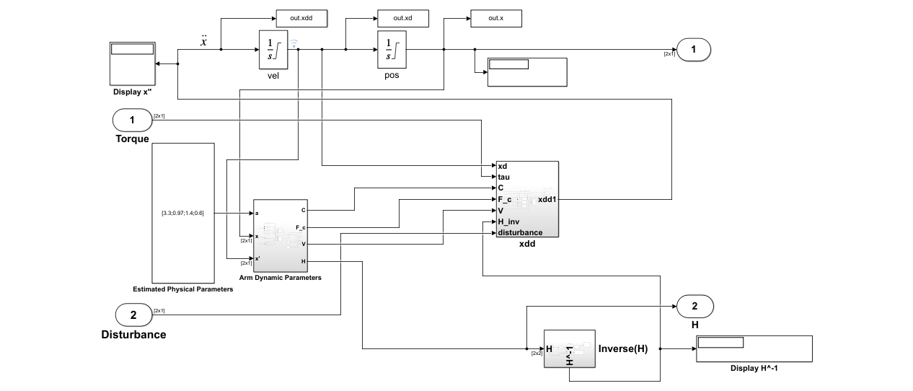

# Adaptive Sliding Mode Control of 2 DOF Robotic Arm

## 2DOF Robot Arm Model on Simulink

$
\ddot{x} = H^{-1} (\tau - C \dot{x} - F_c sgn(\dot{x}) - V \dot{x})
$

Where:

$  
\tau = \begin{bmatrix}
\tau_1 & \tau_2
\end{bmatrix}^T
$

$  
x = \begin{bmatrix}
x_1 & x
\end{bmatrix}^T
$

$
\ddot{x} = \frac{d}{dx}\dot{x} = \frac{d^2}{dx}x $

$
H = \begin{bmatrix}
M_{11} & M_{12} \\
M_{21} & M_{22}
\end{bmatrix}
$ where:

- $ M_{11} = a_1 + 2 a_3 cos(x_2) - 2 a_4 sin(x_2) $
- $ M_{12} = M_{21} = a_2 + a_3 cos(x_2) + a_4 cos(x_2) $
- M_22 = a_2

$
C = \begin{bmatrix}
-c\dot{x}_2 & -c(\dot{x}_1 + \dot{x_2}) \\
c\dot{x}_1 & 0
\end{bmatrix}
$ where:

- $ c = a_3 sin(x_2) - a_4 cos(x_2) $

$
a = \begin{bmatrix}
a_1 \\
a_2 \\
a_3 \\
a_4
\end{bmatrix} = \begin{bmatrix}
3.3 \\
0.97 \\
1.4 \\
0.6
\end{bmatrix}
$

$
F_c = \begin{bmatrix}
F_{c1} & 0 \\
0 & F_{c2}
\end{bmatrix}
$ where:

- $ F_{c1} = F_{c2} = 5$

$
V = \begin{bmatrix}
V_{1} & 0 \\
0 & V_{2}
\end{bmatrix}
$ where:

- $ V_1 = 5.5 $ and $ V_2 = 2.7 $

Given initial conditions:

- $ x_1 = 0.3 \space rad $ and $ x_2 = 0.5 \space rad $



### Numerical Considerations

#### Integrators

Used limited output integrators between $ -2\pi $ and $ +2\pi $.

#### Safe Matrix Inverse

Used a small regularization term:

```matlab
epsilon = 1e-6; % Small regularization term
H_reg = H + epsilon * eye(size(H));
H_inv = inv(H_reg);
```

In addition to using pseudoinverse if matrix is close to singular or badly scaled.

#### Handling `NaN` and `inf` Values

Implemented an algorithm to detect `NaN` and `inf` values, by using these replacements:

```matlab
nan_replacement = eps; % A very small positive number
inf_replacement = realmax; % The largest positive floating-point number
```
